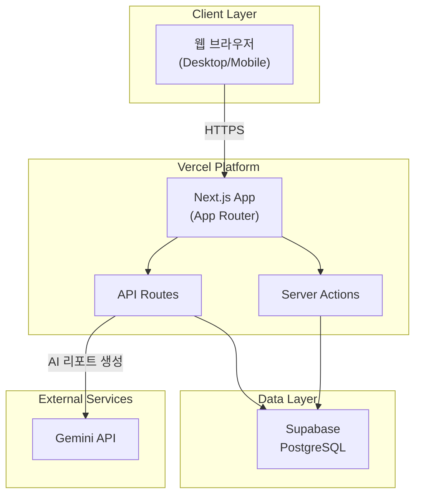
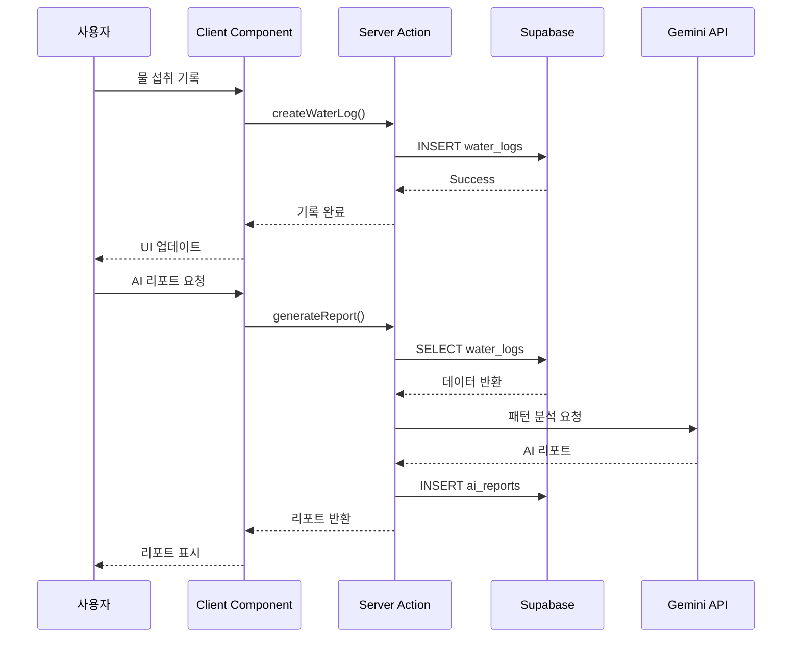
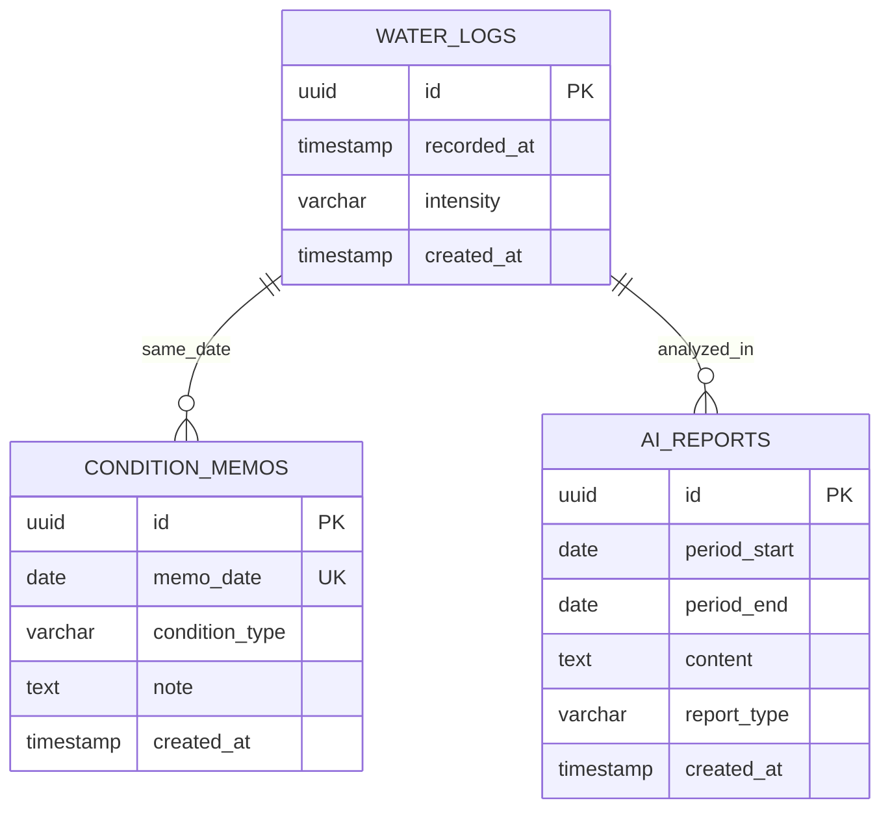
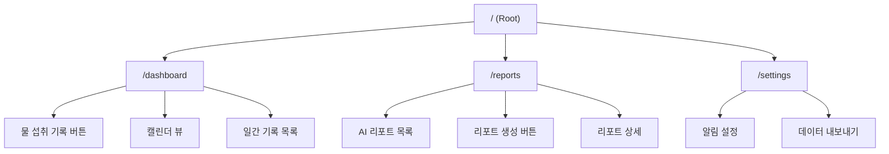
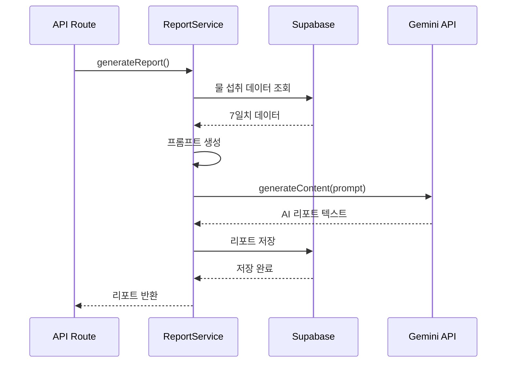

# 소프트웨어 설계 문서 (Software Design Document)

> 물 섭취 습관 관리 앱 – 기록이 아닌 해석 중심

---

## 1. 개요

### 1.1 프로젝트 목표
물 섭취 기록을 AI가 해석하여 의미 있는 인사이트를 제공하는 습관 관리 앱

### 1.2 MVP 범위
- 물 섭취 기록 CRUD
- 캘린더 기반 시각화
- Gemini API 기반 AI 리포트
- 컨디션 메모

---

## 2. 기술 스택

### 2.1 프론트엔드
| 기술 | 버전 | 용도 |
|------|------|------|
| Next.js | 14+ | Full-stack 프레임워크 (App Router) |
| React | 18+ | UI 라이브러리 |
| TypeScript | 5+ | 타입 안정성 |
| Tailwind CSS | 3+ | 스타일링 |
| shadcn/ui | latest | UI 컴포넌트 |
| Recharts | 2+ | 차트/시각화 |

### 2.2 백엔드
| 기술 | 용도 |
|------|------|
| Next.js API Routes | RESTful API |
| Next.js Server Actions | 서버 사이드 로직 |
| Supabase Client | 데이터베이스 연결 |

### 2.3 데이터베이스
| 기술 | 용도 |
|------|------|
| Supabase PostgreSQL | 관계형 데이터베이스 |
| Supabase Storage | 파일 저장 (선택) |

### 2.4 AI 및 외부 서비스
| 서비스 | 용도 |
|---------|------|
| Gemini API | AI 리포트 생성 |
| Vercel | 호스팅 및 배포 |

---

## 3. 시스템 아키텍처

### 3.1 전체 아키텍처



### 3.2 요청 흐름



---

## 4. 데이터베이스 설계

### 4.1 ERD



### 4.2 테이블 상세

#### water_logs
```sql
CREATE TABLE water_logs (
  id UUID PRIMARY KEY DEFAULT gen_random_uuid(),
  recorded_at TIMESTAMPTZ NOT NULL DEFAULT NOW(),
  intensity VARCHAR(20) NOT NULL CHECK (intensity IN ('high', 'medium', 'low')),
  created_at TIMESTAMPTZ NOT NULL DEFAULT NOW(),
  updated_at TIMESTAMPTZ NOT NULL DEFAULT NOW()
);

CREATE INDEX idx_water_logs_recorded_at ON water_logs(recorded_at DESC);
```

#### condition_memos
```sql
CREATE TABLE condition_memos (
  id UUID PRIMARY KEY DEFAULT gen_random_uuid(),
  memo_date DATE NOT NULL UNIQUE,
  condition_type VARCHAR(20) CHECK (condition_type IN ('tired', 'swollen', 'refreshed', 'normal')),
  note TEXT,
  created_at TIMESTAMPTZ NOT NULL DEFAULT NOW(),
  updated_at TIMESTAMPTZ NOT NULL DEFAULT NOW()
);

CREATE INDEX idx_condition_memos_date ON condition_memos(memo_date DESC);
```

#### ai_reports
```sql
CREATE TABLE ai_reports (
  id UUID PRIMARY KEY DEFAULT gen_random_uuid(),
  period_start DATE NOT NULL,
  period_end DATE NOT NULL,
  content TEXT NOT NULL,
  report_type VARCHAR(20) DEFAULT 'weekly' CHECK (report_type IN ('weekly', 'on_demand')),
  created_at TIMESTAMPTZ NOT NULL DEFAULT NOW()
);

CREATE INDEX idx_ai_reports_created_at ON ai_reports(created_at DESC);
```

---

## 5. 프론트엔드 설계

### 5.1 페이지 구조



### 5.2 레이아웃 구조 (Google Calendar 스타일)

```
┌─────────────────────────────────────────────────┐
│  Header (앱 타이틀 + 사용자 정보)                │
├──────────┬──────────────────────────────────────┤
│          │  Main Content                         │
│          │  ┌─────────────────────────────────┐ │
│ Sidebar  │  │                                 │ │
│          │  │  캘린더 뷰                       │ │
│ - 홈     │  │  + 물 섭취 기록 버튼             │ │
│ - 리포트 │  │                                 │ │
│ - 설정   │  │─────────────────────────────────│ │
│          │  │  일간 기록 리스트               │ │
│          │  │  - 09:30 마셨음                 │ │
│          │  │  - 14:15 조금 마셨음            │ │
│          │  └─────────────────────────────────┘ │
└──────────┴──────────────────────────────────────┘
```

### 5.3 반응형 디자인

**Desktop (>= 1024px)**
- 사이드바 고정 (240px)
- 메인 콘텐츠 넓게 표시

**Tablet (768px ~ 1023px)**
- 사이드바 축소 가능
- 아이콘 + 텍스트 표시

**Mobile (< 768px)**
- 사이드바 숨김 (햄버거 메뉴)
- 하단 네비게이션 바 사용

### 5.4 주요 컴포넌트

```typescript
// 컴포넌트 구조
/app
  /layout.tsx                 // 루트 레이아웃
  /dashboard
    /page.tsx                 // 대시보드 페이지
  /reports
    /page.tsx                 // 리포트 목록
    /[id]
      /page.tsx               // 리포트 상세
  /settings
    /page.tsx                 // 설정 페이지

/components
  /layout
    /Sidebar.tsx              // 사이드바 네비게이션
    /Header.tsx               // 헤더
    /MobileNav.tsx            // 모바일 네비게이션
  /dashboard
    /WaterLogButton.tsx       // 물 섭취 기록 버튼
    /CalendarView.tsx         // 캘린더 뷰
    /DailyLogList.tsx         // 일간 기록 목록
    /ConditionMemo.tsx        // 컨디션 메모 입력
  /reports
    /ReportCard.tsx           // 리포트 카드
    /ReportGenerator.tsx      // 리포트 생성 버튼
    /ReportViewer.tsx         // 리포트 뷰어
  /ui                         // shadcn/ui 컴포넌트
```

### 5.5 상태 관리

```typescript
// React useState + Context API 사용
// 전역 상태: 사용자 설정, 알림 설정
// 로컬 상태: 폼 입력, UI 상태

// 예시: 물 섭취 기록 상태
type WaterLog = {
  id: string;
  recordedAt: Date;
  intensity: 'high' | 'medium' | 'low';
};

// Server State: React Query 또는 SWR 사용 예정
// - 데이터 캐싱
// - 자동 리페칭
// - Optimistic Updates
```

---

## 6. 백엔드 설계

### 6.1 API 엔드포인트

#### 물 섭취 기록 API
```typescript
// GET /api/water-logs?from=2024-01-01&to=2024-01-31
// 응답: { logs: WaterLog[] }

// POST /api/water-logs
// 요청: { intensity: 'high' | 'medium' | 'low', recordedAt?: string }
// 응답: { log: WaterLog }

// PATCH /api/water-logs/[id]
// 요청: { intensity: 'high' | 'medium' | 'low' }
// 응답: { log: WaterLog }

// DELETE /api/water-logs/[id]
// 응답: { success: boolean }
```

#### AI 리포트 API
```typescript
// GET /api/reports?limit=10
// 응답: { reports: AIReport[] }

// POST /api/reports/generate
// 요청: { periodStart?: string, periodEnd?: string }
// 응답: { report: AIReport }

// GET /api/reports/[id]
// 응답: { report: AIReport }
```

#### 컨디션 메모 API
```typescript
// GET /api/condition-memos?date=2024-01-15
// 응답: { memo: ConditionMemo | null }

// POST /api/condition-memos
// 요청: { memoDate: string, conditionType: string, note?: string }
// 응답: { memo: ConditionMemo }
```

### 6.2 Server Actions

```typescript
// app/actions/water-logs.ts
export async function createWaterLog(data: { intensity: string }) {
  const supabase = createClient();
  const { data: log, error } = await supabase
    .from('water_logs')
    .insert({ intensity: data.intensity })
    .select()
    .single();
  
  if (error) throw error;
  revalidatePath('/dashboard');
  return log;
}

// app/actions/ai-reports.ts
export async function generateAIReport() {
  // 1. 최근 7일 데이터 조회
  // 2. Gemini API 호출
  // 3. 리포트 저장
  // 4. 리턴
}
```

### 6.3 서비스 레이어

```typescript
// lib/services/water-log.service.ts
export class WaterLogService {
  async getLogsByDateRange(from: Date, to: Date) { }
  async createLog(intensity: string, recordedAt?: Date) { }
  async updateLog(id: string, intensity: string) { }
  async deleteLog(id: string) { }
  async getLogsSummaryByDay(from: Date, to: Date) { }
}

// lib/services/ai-report.service.ts
export class AIReportService {
  async generateReport(periodStart: Date, periodEnd: Date) { }
  async getReportById(id: string) { }
  async getRecentReports(limit: number) { }
}
```

---

## 7. AI 통합 설계

### 7.1 Gemini API 연동 흐름



### 7.2 프롬프트 설계

```typescript
const generatePrompt = (logs: WaterLog[], memos: ConditionMemo[]) => {
  return `
당신은 물 섭취 습관을 분석하는 친근한 코치입니다.

**분석 데이터**
${logs.map(log => `- ${log.recordedAt}: ${log.intensity}`).join('\n')}

**컨디션 메모**
${memos.map(m => `- ${m.memoDate}: ${m.conditionType}`).join('\n')}

**요구사항**
1. 관찰 → 해석 → 제안 순서로 작성
2. 평가·훈계 금지
3. 실패 전제 언어 사용 금지
4. 긍정적이고 공감적인 톤

**출력 형식**
- 2-3문단, 200자 이내
- 구체적인 패턴 언급
`;
};
```

### 7.3 AI 리포트 생성 로직

```typescript
// lib/ai/gemini-client.ts
import { GoogleGenerativeAI } from '@google/generative-ai';

export class GeminiClient {
  private genAI: GoogleGenerativeAI;
  
  constructor() {
    this.genAI = new GoogleGenerativeAI(process.env.GEMINI_API_KEY!);
  }
  
  async generateReport(prompt: string): Promise<string> {
    const model = this.genAI.getGenerativeModel({ model: 'gemini-pro' });
    const result = await model.generateContent(prompt);
    const response = await result.response;
    return response.text();
  }
}
```

---

## 8. 배포 전략

### 8.1 Vercel 배포 설정

```json
// vercel.json
{
  "framework": "nextjs",
  "buildCommand": "npm run build",
  "devCommand": "npm run dev",
  "env": {
    "NEXT_PUBLIC_SUPABASE_URL": "@supabase-url",
    "NEXT_PUBLIC_SUPABASE_ANON_KEY": "@supabase-anon-key",
    "GEMINI_API_KEY": "@gemini-api-key"
  }
}
```

### 8.2 환경 변수

```bash
# .env.local
NEXT_PUBLIC_SUPABASE_URL=https://xxx.supabase.co
NEXT_PUBLIC_SUPABASE_ANON_KEY=eyJxxx...
GEMINI_API_KEY=AIzaSyxxx...
```

---

## 9. 보안 및 성능

### 9.1 보안 고려사항

- **API 보안**: Server Actions 사용으로 클라이언트 노출 최소화
- **환경 변수**: Vercel 환경 변수로 민감 정보 관리
- **RLS**: Supabase Row Level Security 활용 (추후 인증 추가 시)
- **Input Validation**: Zod 스키마로 입력 검증

### 9.2 성능 최적화

- **캐싱**: Next.js 자동 캐싱 활용
- **이미지**: Next.js Image 컴포넌트 사용
- **코드 스플리팅**: 동적 import 활용
- **DB 인덱스**: 날짜 기반 쿼리 최적화

### 9.3 모니터링

- **Vercel Analytics**: 기본 성능 모니터링
- **Error Tracking**: Sentry 또는 Vercel Logs
- **Gemini API 사용량**: 일일 할당량 모니터링

---

## 10. 향후 확장 고려사항

### 10.1 인증 추가
- Supabase Auth를 활용한 이메일 로그인
- 소셜 로그인 (Google, Apple)

### 10.2 알림 기능
- 웹 푸시 알림 (Progressive Web App)
- 시간대 기반 스마트 알림

### 10.3 데이터 분석
- 장기 트렌드 분석
- 월간/연간 리포트

---

## 부록

### A. 폴더 구조 (예상)

```
water-tracker/
├── app/
│   ├── layout.tsx
│   ├── page.tsx
│   ├── dashboard/
│   │   └── page.tsx
│   ├── reports/
│   │   ├── page.tsx
│   │   └── [id]/
│   │       └── page.tsx
│   ├── settings/
│   │   └── page.tsx
│   └── api/
│       ├── water-logs/
│       ├── reports/
│       └── condition-memos/
├── components/
│   ├── layout/
│   ├── dashboard/
│   ├── reports/
│   └── ui/
├── lib/
│   ├── supabase/
│   │   └── client.ts
│   ├── ai/
│   │   └── gemini-client.ts
│   └── services/
│       ├── water-log.service.ts
│       └── ai-report.service.ts
├── actions/
│   ├── water-logs.ts
│   └── ai-reports.ts
└── types/
    └── index.ts
```

### B. 개발 순서 권장사항

1. **Phase 1**: 프로젝트 셋업 + Supabase 연동
2. **Phase 2**: 물 섭취 기록 CRUD + 캘린더 뷰
3. **Phase 3**: Gemini API 연동 + AI 리포트
4. **Phase 4**: 컨디션 메모 + UI/UX 개선
5. **Phase 5**: 배포 + 테스트

---

**문서 버전**: 1.0  
**작성일**: 2025-12-20  
**작성자**: Development Team
