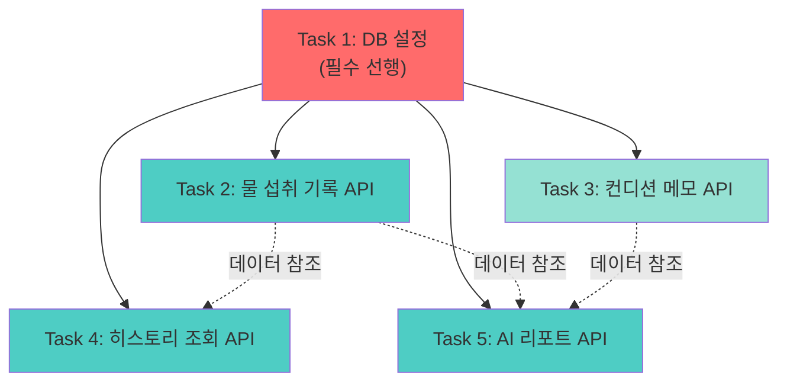

# 백엔드 개발 작업 통합 가이드

> 물 섭취 습관 관리 앱 - 백엔드 개발 작업 분장 및 통합 가이드

---

## 📋 개요

이 문서는 백엔드 개발을 병렬로 수행 가능한 작업 단위로 분리하고, 각 작업을 통합하는 방법을 안내합니다.

### 전체 작업 목표
- Supabase PostgreSQL 데이터베이스 구축
- Next.js API Routes/Server Actions로 백엔드 API 구현
- Gemini API 연동 (gemini-3-flash-preview 모델 사용)
- 프론트엔드 페이지와 완전한 연동

---

## 🎯 작업 단위 분류

총 **5개의 독립적인 작업 단위**로 분리되며, 각각 병렬로 개발 가능합니다.

| 작업 ID | 작업명 | 예상 소요 | 우선순위 | 프론트엔드 연동 |
|---------|--------|-----------|----------|-----------------|
| Task 1 | Supabase 설정 및 DB 스키마 구축 | 1-2시간 | P0 (최우선) | 모든 페이지 |
| Task 2 | 물 섭취 기록 API | 2-3시간 | P0 | 홈 페이지 |
| Task 3 | 컨디션 메모 API | 1-2시간 | P1 | 홈 페이지 |
| Task 4 | 히스토리 조회 API | 2-3시간 | P0 | 히스토리 페이지 |
| Task 5 | AI 리포트 생성 API | 3-4시간 | P0 | 리포트 페이지 |

---

## 📊 작업 의존성 및 순서



### 의존성 설명

**필수 선행 작업**
- **Task 1**은 모든 작업의 선행 조건 (데이터베이스 스키마 필요)

**병렬 수행 가능**
- Task 2, 3, 4, 5는 Task 1 완료 후 **동시에 병렬 개발 가능**
- 각 Task는 서로 다른 테이블/엔드포인트를 다루므로 충돌 없음

**데이터 참조 관계**
- Task 4, 5는 Task 2의 데이터를 조회만 하므로 개발 중에도 문제없음
- Task 5는 Task 3의 데이터도 선택적으로 참조 (없어도 작동)

---

## 🔄 통합 전략

### 1단계: 기반 구축 (Task 1)
```bash
# Task 1 완료 후 확인사항
✓ Supabase 프로젝트 생성
✓ 환경 변수 설정
✓ 3개 테이블 생성 (water_logs, condition_memos, ai_reports)
✓ Supabase 클라이언트 초기화
```

### 2단계: 병렬 개발 (Task 2, 3, 4, 5)
각 개발자가 독립적으로 작업 가능:
- 서로 다른 파일에서 작업 (파일 충돌 없음)
- 서로 다른 API 엔드포인트 (라우팅 충돌 없음)
- 독립적인 테이블 접근 (DB 충돌 없음)

### 3단계: 통합 및 테스트
```bash
# 모든 Task 완료 후
1. 각 API 엔드포인트 개별 테스트
2. 프론트엔드 연동 테스트
3. 전체 플로우 테스트
```

---

## 📁 파일 구조 및 충돌 방지

### 예상 파일 구조
```
water/
├── lib/
│   ├── supabase/
│   │   ├── client.ts           [Task 1]
│   │   └── schema.sql          [Task 1]
│   └── ai/
│       └── gemini.ts           [Task 5]
├── app/
│   └── api/
│       ├── water-logs/
│       │   └── route.ts        [Task 2]
│       ├── condition-memos/
│       │   └── route.ts        [Task 3]
│       ├── history/
│       │   └── route.ts        [Task 4]
│       └── reports/
│           ├── route.ts        [Task 5]
│           └── generate/
│               └── route.ts    [Task 5]
└── actions/
    ├── water-logs.ts           [Task 2]
    ├── condition-memos.ts      [Task 3]
    ├── history.ts              [Task 4]
    └── reports.ts              [Task 5]
```

### 충돌 방지 규칙
✅ **각 Task는 별도 디렉토리/파일에서 작업**  
✅ **공통 파일(lib/supabase/client.ts)은 Task 1에서만 생성**  
✅ **타입 정의는 각 Task별 파일에 포함 (나중에 통합 가능)**  
✅ **환경 변수는 공유하되, 각 Task는 독립적으로 접근**

---

## 🔗 프론트엔드 연동 매핑

### 홈 페이지 (/)
- **컴포넌트**: `IntakeRecorder`, `TodayIntakeList`
- **필요 API**: Task 2 (물 섭취 기록 CRUD)
- **선택 API**: Task 3 (컨디션 메모)

### 히스토리 페이지 (/history)
- **컴포넌트**: `CalendarView`
- **필요 API**: Task 4 (날짜별 기록 조회)

### 리포트 페이지 (/reports)
- **컴포넌트**: `ReportGenerator`, `ReportList`
- **필요 API**: Task 5 (리포트 생성 및 조회)

---

## 📝 각 작업별 실행 프롬프트

### Task 1: Supabase 설정 및 DB 스키마

```
@docs/tasks/task-database-setup-plan.md @docs/software_design.md 를 기반으로 Supabase 데이터베이스를 설정하고 스키마를 구축해줘.

필수 작업:
1. Supabase 프로젝트 연동 (환경 변수 설정)
2. water_logs, condition_memos, ai_reports 테이블 생성
3. lib/supabase/client.ts 파일 생성
4. 연결 테스트 코드 작성

참고 문서:
- docs/software_design.md (데이터베이스 ERD 및 스키마)
- docs/PRD.md (프로젝트 요구사항)
```

### Task 2: 물 섭취 기록 API

```
@docs/tasks/task-water-logs-api-plan.md @docs/user_stories.md (US-001, US-003, US-015) 를 참고하여 물 섭취 기록 API를 구현해줘.

필수 작업:
1. POST /api/water-logs - 기록 생성
2. GET /api/water-logs - 기록 조회 (날짜 범위)
3. PATCH /api/water-logs/[id] - 기록 수정
4. DELETE /api/water-logs/[id] - 기록 삭제
5. Server Actions (actions/water-logs.ts) 구현
6. 프론트엔드 IntakeRecorder, TodayIntakeList와 연동

참고 문서:
- docs/user_stories.md (US-001, US-003, US-015)
- components/features/intake/intake-recorder.tsx
- components/features/intake/today-intake-list.tsx
```

### Task 3: 컨디션 메모 API

```
@docs/tasks/task-condition-memos-api-plan.md @docs/user_stories.md (US-009, US-010) 를 참고하여 컨디션 메모 API를 구현해줘.

필수 작업:
1. POST /api/condition-memos - 메모 생성/수정
2. GET /api/condition-memos - 날짜별 메모 조회
3. Server Actions (actions/condition-memos.ts) 구현
4. 프론트엔드 홈 페이지와 연동

참고 문서:
- docs/user_stories.md (US-009, US-010)
- app/page.tsx (홈 페이지)
```

### Task 4: 히스토리 조회 API

```
@docs/tasks/task-history-api-plan.md @docs/user_stories.md (US-003, US-004) 를 참고하여 히스토리 조회 API를 구현해줘.

필수 작업:
1. GET /api/history - 날짜 범위별 통계 조회
2. 캘린더 뷰용 데이터 포맷 제공
3. Server Actions (actions/history.ts) 구현
4. 프론트엔드 CalendarView와 연동

참고 문서:
- docs/user_stories.md (US-003, US-004)
- components/features/history/calendar-view.tsx
- app/history/page.tsx
```

### Task 5: AI 리포트 생성 API

```
@docs/tasks/task-ai-reports-api-plan.md @docs/user_stories.md (US-005, US-006, US-007, US-008) @docs/PRD.md 를 참고하여 AI 리포트 생성 API를 구현해줘.

필수 작업:
1. Gemini API 클라이언트 구축 (lib/ai/gemini.ts)
   - 모델: gemini-3-flash-preview (필수)
2. POST /api/reports/generate - 리포트 생성
3. GET /api/reports - 리포트 목록 조회
4. GET /api/reports/[id] - 리포트 상세 조회
5. Server Actions (actions/reports.ts) 구현
6. 프롬프트 설계 (관찰 → 해석 → 제안)
7. 프론트엔드 ReportGenerator, ReportList와 연동

참고 문서:
- docs/user_stories.md (US-005~008)
- docs/PRD.md (AI 리포트 톤 및 원칙)
- docs/software_design.md (프롬프트 설계)
- components/features/reports/report-generator.tsx
- components/features/reports/report-list.tsx

중요 제약사항:
- Gemini 모델은 반드시 gemini-3-flash-preview 사용
```

---

## ✅ 통합 체크리스트

### Task 1 완료 후
- [ ] Supabase 연결 확인
- [ ] 모든 테이블 생성 확인
- [ ] 환경 변수 설정 완료
- [ ] 다른 Task 개발자에게 DB URL 공유

### Task 2~5 완료 후
- [ ] 각 API 엔드포인트 Postman/Thunder Client 테스트
- [ ] 프론트엔드 컴포넌트와 API 연동 확인
- [ ] 에러 핸들링 구현 확인
- [ ] 타입 안정성 확인

### 전체 통합 후
- [ ] 홈 페이지: 물 섭취 기록 + 조회 + 수정/삭제
- [ ] 히스토리 페이지: 캘린더 뷰 데이터 표시
- [ ] 리포트 페이지: AI 리포트 생성 + 목록 조회
- [ ] 전체 플로우 테스트 (기록 → 히스토리 확인 → 리포트 생성)

---

## 🚨 주의사항

### 공통 규칙
1. **환경 변수 통일**: 모든 Task는 동일한 `.env.local` 사용
2. **타입 안정성**: TypeScript 타입 정의 필수
3. **에러 핸들링**: 모든 API에 try-catch 구현
4. **일관된 응답 포맷**: `{ success: boolean, data?: T, error?: string }`

### Gemini API 사용 시 (Task 5)
- ⚠️ 모델명: **gemini-3-flash-preview** (다른 모델 사용 금지)
- API 키: GEMINI_API_KEY 환경 변수
- 요청 제한: 고려하여 에러 핸들링

### 데이터베이스
- 테이블 수정 시 모든 Task 개발자에게 공유
- 마이그레이션 스크립트 관리

---

## 📚 참고 문서

- [PRD.md](../PRD.md) - 프로젝트 요구사항
- [user_stories.md](../user_stories.md) - 사용자 스토리
- [software_design.md](../software_design.md) - 소프트웨어 설계

---

**작성일**: 2025-12-20  
**버전**: 1.0  
**다음 단계**: 각 Task별 상세 계획 문서 확인 및 개발 시작
